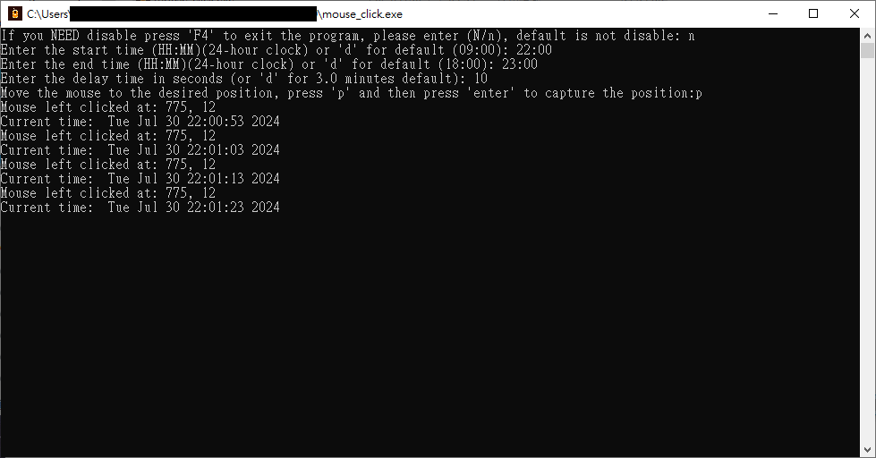

## Introduction(簡介)

This Python script is a demonstration using the PyAutoGUI library to simulate mouse clicks at specific times. The script captures user input for start and end times, delay time, and records the initial mouse position. It then continuously checks the current time and simulates a left mouse click within the specified time range.

這個 Python 腳本是一個使用 PyAutoGUI 庫演示在特定時間模擬滑鼠點擊的範例。腳本的功能包括捕捉使用者輸入的開始和結束時間、延遲時間，並記錄初始滑鼠位置。然後，腳本會持續檢查當前時間，並在指定的時間範圍內模擬左鍵滑鼠點擊。

## Author Information

### Name
Curtis Hsu(Ying-Hao Hsu)

### Creation Date
March 27, 2024

### Contact Information
- **Email**: ar06053127hga@hotmail.com.tw
- **GitHub**: [Curtis081](https://github.com/Curtis081)
- **LinkedIn**: [Curtis Hsu(Ying-Hao Hsu)](https://www.linkedin.com/in/yinghaohsu/)

#### Note
For any inquiries or contributions regarding this project, please feel free to contact me through the above channels. If reporting bugs or requesting features, consider opening an issue on GitHub for public tracking and documentation.
